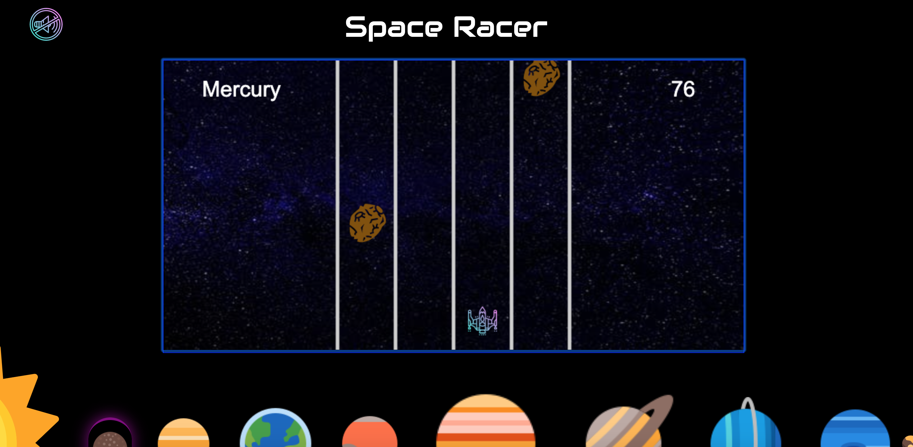
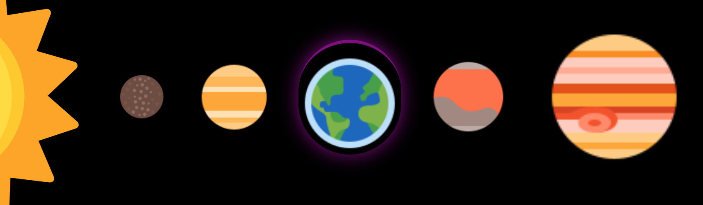
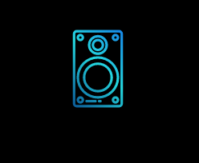

# SpaceRacer

[Live Demo](https://tsanta96.github.io/SpaceRacer/ "Live Demo")

SpaceRacer is a space themed game inspired by "Protect Your Car". The goal is to
survive the flight from the Sun to Pluto without crashing into an asteroid as the levels become
increasingly difficult. 

## Technologies

SpaceRacer was built entirely with pure Javascript and styled with CSS. I make 
extensive use of the HTML Canvas Api as this provides the ability to animate by 
continuously redrawing objects and rendering new frames.

## Features

- The main feature is obviously the game itself. I built the game to have 4 evenly sized lanes 
in the middle of the screen that you can navigate between by using your 'left' and 'right' arrow keys
on your keyboard. Depending on the level, the speed and amount of asteroids vary and the goal 
is to avoid these asteroids as they approach. 

- There is a map at the bottom of the screen that allows you to see which level (planet) you currently on
by highlighting the respective planet in a purple aura. 

- There is a speaker button that allows you to toggle the soundtrack on and off and when the game
is initially started the soundtrack automatically plays. 

## Future Features

- Add local Highscores

